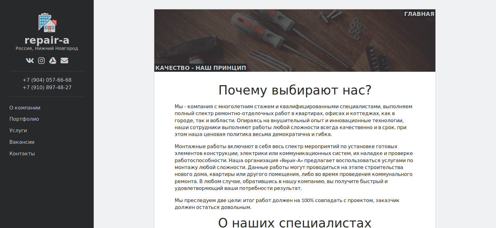

# Repair-a

Repair-a website source.



## Install

```console
foo@bar: repair-a-web $ yarn install
foo@bar: repair-a-web $ gulp
foo@bar: repair-a-web $ mvn install
```

## Run

```console
foo@bar: repair-a-web $ mvn spring-boot:run
```

## License

[GNU General Public License](LICENSE.md)
